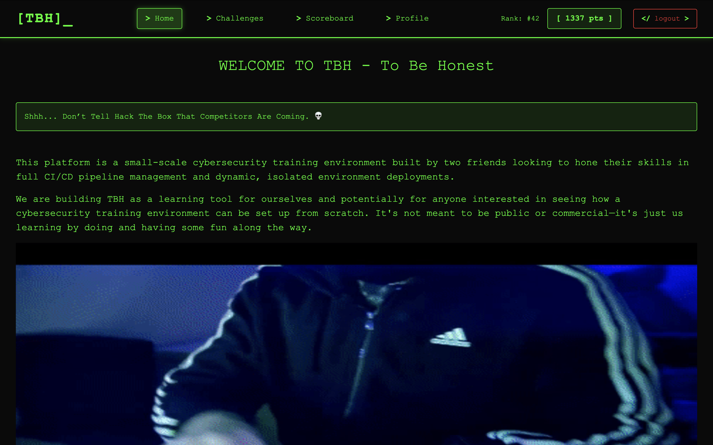

# TBH - Gamified Cybersecurity Training Platform

TBH ("To Be Honest") is a gamified penetration testing environment inspired by platforms like Hack The Box. The platform is designed to provide an engaging way for users to practice and enhance their cybersecurity skills by completing challenges hosted on isolated environments.

## Key Features

1. **Gamified Challenges:**
    - Users can interact with various penetration testing challenges (e.g., web servers).
    - Challenges are containerized using Docker and orchestrated with Kubernetes.

2. **Backend (Spring Boot):**
    - Handles requests from the frontend and manages challenge deployment.
    - Reads deployment paths from the database for challenge-specific Kubernetes configurations.

3. **Frontend (Angular):**
    - Provides an intuitive UI where users can select and deploy challenges.
    - Displays challenge information and dynamically updates the status.

4. **Networking and DNS (dnsmasq):**
    - The backend integrates with `dnsmasq` to configure local DNS entries.
    - Each challenge is assigned a subdomain (e.g., `challenge.tbh.com`) for accessibility.
   
5. **Access Control:**
    - Users connect to the platform via VPN, gaining access to deployed challenges within a secure network.

6. **CI/CD Pipeline:**
    - Jenkins is used for continuous integration and deployment to ensure streamlined updates and reliable operations.


## Workflow

1. **Challenge Deployment:**
    - A user selects a challenge and clicks "Run" on the frontend.
    - The frontend sends a request to the backend to deploy the challenge.
    - The backend fetches the corresponding Kubernetes deployment YAML file and applies it.

2. **Service and Ingress Setup:**
    - Kubernetes creates the necessary Deployment, Service, and Ingress resources.
    - A unique subdomain is assigned to the challenge container.

3. **DNS Configuration (dnsmasq):**
    - The backend interacts with `dnsmasq` to dynamically add DNS entries for the challenge's subdomain (e.g., `challenge.tbh.com`) pointing to `127.0.0.1`.

4. **Challenge Access:**
    - Users access challenges via their assigned subdomains within the VPN-secured network.


## Technology Stack

### Frontend
- Angular
- TypeScript

### Backend
- Spring Boot (Java)
- PostgreSQL (Database)

### Infrastructure
- Kubernetes (K8s)
- Docker (Challenge Containers)

### Automation & CI/CD
- Jenkins (Pipeline)

### Logging & Monitoring
- ELK Stack (Elasticsearch, Logstash, Kibana) - Planned


## Current Goals

### Backend
- **Challenge Lifecycle Management:** Automatically delete challenge resources after a timeout or allow users to extend the duration.
- **User Isolation:** Ensure users can only access challenges they deployed.

### Frontend
- **Challenge Page:** Display the challenge domain after deployment and provide options to extend the duration or stop the challenge.

### Kubernetes
- **Scaling:** Implement resource-based scaling for high user activity.

### CI/CD
- Build and deploy all components (Angular, Spring Boot, DNS, Database) using a single `deployment.yaml` file.


## Future Plans
- **Virtual Machine Support:** Extend challenge hosting to include VMs.
- **Production Readiness:** Refine configurations for deployment in production environments.
- **Logging:** Use the ELK stack for logging and troubleshooting.


## Screenshots

### Home Page


### Scoreboard


## Running Locally

1. Clone the repository:
   ```bash
   git clone https://github.com/0xkr4k3n/TBH
   cd TBH
   ```

2. Set up the backend and database:
    - Run the Spring Boot application.
    - Ensure PostgreSQL is running and seeded with necessary data.

3. Set up the frontend:
    - Navigate to the Angular project directory.
    - Install dependencies:
      ```bash
      npm install
      ```
    - Start the development server:
      ```bash
      ng serve
      ```

4. Start Kubernetes:
    - Ensure the Backend server can communicate with k8s.
    - Update `/etc/hosts` for local DNS resolution.

5. Access the platform via the Angular frontend.


## Contributing

Contributions are welcome! Please create a pull request or open an issue to suggest improvements or report bugs.
